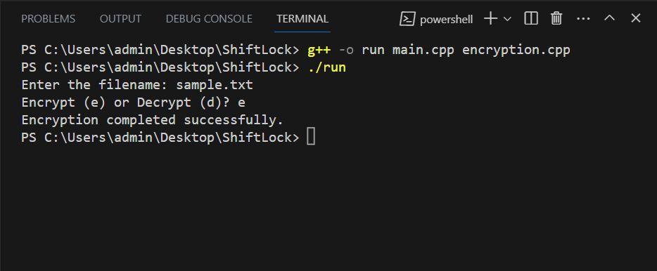

## ShiftLock : Secure Text Encryption using Caesar Cipher

This project demonstrates a simple implementation of text encryption and decryption using the Caesar cipher. The Caesar cipher is a basic substitution cipher where each letter in the plaintext is shifted a certain number of places down or up the alphabet.

## Features

- Encrypts and decrypts text files using a Caesar cipher.
- Provides options to choose between encryption and decryption modes.
- Basic Caesar cipher algorithm implementation.
- User-friendly command-line interface.

## Getting Started

1. Clone the repository:
   ```bash
   git clone https://github.com/Gufranwaris/ShiftLock.git
   cd ShiftLock
   ```
2. Compile the source files (main.cpp, encryption.cpp):
    ```bash
   g++ -o run main.cpp encryption.cpp
   ```
3. Run the executable:
    ```bash
   ./run
   ```
4. Follow the on-screen instructions to provide the filename and choose the encryption/decryption mode.




## Encryption Algorithm

The project uses the Caesar cipher algorithm to shift each letter in the plaintext by a fixed number of positions. The performCaeserCipher function handles the encryption/decryption logic.

## Files

- **main.cpp :** User interaction and mode selection.
- **encryption.cpp :** Implementation of encryption and decryption functions.
- **encryption.h :** Header file containing function declarations.

## Example

- Consider a sample file named "sample.txt" with the content:
   ```bash
  Decide on a controlling idea and create a topic sentence Paragraph development begins
   ```
- After encryption, the content might look like:
   ```bash
  Ghflgh rq d frphulqj lghd dqg fhuduh d wrsl vhqwhvv Sduwlphu ghvljqflqj eholqv
   ```
   
## Note

- The Caesar cipher used here is a basic substitution cipher and is not suitable for strong security purposes.
- This project is intended for educational purposes and to demonstrate basic file handling and algorithm implementation.
"# shiftLock" 
